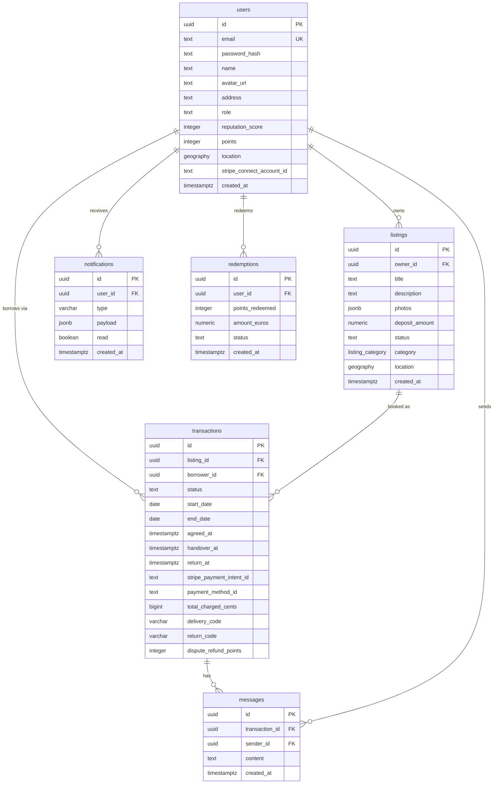

# Data Model

This document describes the real database schema of NeighborLink. The database is PostgreSQL with the PostGIS extension enabled, hosted on Supabase.

---

## Entity Relationship Diagram



---

## Tables

### `users`

| Column | Type | Nullable | Default | Description |
|---|---|---|---|---|
| `id` | `uuid` PK | NO | `gen_random_uuid()` | Auto-generated identifier |
| `email` | `text` UNIQUE | NO | — | Used for login |
| `password_hash` | `text` | NO | — | bcrypt hash of the password |
| `name` | `text` | NO | — | Display name |
| `avatar_url` | `text` | YES | — | URL stored in Supabase Storage |
| `address` | `text` | YES | — | Human-readable address entered at registration |
| `role` | `text` | YES | `'user'` | `user` or `admin` |
| `reputation_score` | `integer` | NO | `0` | Score based on received reviews |
| `points` | `integer` | NO | `0` | Points balance in euro-cents earned as a lender |
| `location` | `geography` | YES | — | PostGIS point geocoded from `address` at registration via Nominatim |
| `stripe_connect_account_id` | `text` | YES | — | Stripe Connect account ID for cash redemptions |
| `created_at` | `timestamptz` | NO | `now()` | Creation timestamp |

---

### `listings`

| Column | Type | Nullable | Default | Description |
|---|---|---|---|---|
| `id` | `uuid` PK | NO | `gen_random_uuid()` | Auto-generated identifier |
| `owner_id` | `uuid` FK → `users.id` | NO | — | User who owns the object |
| `title` | `text` | NO | — | Short title (max 120 chars) |
| `description` | `text` | YES | — | Full description |
| `photos` | `jsonb` | NO | `'[]'` | Array of Supabase Storage URLs |
| `deposit_amount` | `numeric` | NO | `0` | Deposit amount in euros |
| `status` | `text` | NO | `'available'` | `available`, `pending_handover`, `pending_return`, `borrowed`, `inactive` |
| `category` | `listing_category` | YES | `'otros'` | Enum: `herramientas`, `material_deportivo`, `material_educativo`, `informatico`, `electrodomesticos`, `jardineria`, `vehiculos`, `ocio_y_juegos`, `ropa_y_accesorios`, `otros` |
| `location` | `geography` | YES | — | PostGIS point — inherited from the owner's location at creation time |
| `created_at` | `timestamptz` | NO | `now()` | Creation timestamp |

---

### `transactions`

| Column | Type | Nullable | Default | Description |
|---|---|---|---|---|
| `id` | `uuid` PK | NO | `gen_random_uuid()` | Auto-generated identifier |
| `listing_id` | `uuid` FK → `listings.id` | NO | — | The listed object being rented |
| `borrower_id` | `uuid` FK → `users.id` | NO | — | The user borrowing the object |
| `status` | `text` | NO | `'pending'` | See lifecycle below |
| `start_date` | `date` | YES | — | Requested rental start date |
| `end_date` | `date` | YES | — | Requested rental end date (max 7 days from start) |
| `agreed_at` | `timestamptz` | YES | — | When the Stripe deposit was authorized |
| `handover_at` | `timestamptz` | YES | — | When the owner confirmed physical handover |
| `return_at` | `timestamptz` | YES | — | When the owner confirmed physical return |
| `stripe_payment_intent_id` | `text` | YES | — | Stripe PaymentIntent ID for the deposit hold |
| `payment_method_id` | `text` | YES | — | Stripe PaymentMethod ID used by the borrower |
| `total_charged_cents` | `bigint` | NO | `0` | Total authorized (deposit + €2.00 platform fee) |
| `delivery_code` | `varchar` | YES | — | One-time numeric code to confirm physical handover |
| `return_code` | `varchar` | YES | — | One-time numeric code to confirm physical return |
| `dispute_refund_points` | `integer` | YES | — | Points refunded by admin in dispute resolution (null if no dispute) |

**Transaction status lifecycle:**

```
pending → awaiting_payment → agreed → handed_over → returned
                                            │
                                     pending_review (dispute open)
                                            │
                                        returned (admin resolves)
```

---

### `messages`

| Column | Type | Nullable | Default | Description |
|---|---|---|---|---|
| `id` | `uuid` PK | NO | `gen_random_uuid()` | Auto-generated identifier |
| `transaction_id` | `uuid` FK → `transactions.id` | NO | — | The transaction this message belongs to |
| `sender_id` | `uuid` FK → `users.id` | NO | — | The sender (or the system user ID for automated messages) |
| `content` | `text` | NO | — | Message content |
| `created_at` | `timestamptz` | NO | `now()` | Creation timestamp |

---

### `notifications`

| Column | Type | Nullable | Default | Description |
|---|---|---|---|---|
| `id` | `uuid` PK | NO | `gen_random_uuid()` | Auto-generated identifier |
| `user_id` | `uuid` FK → `users.id` | NO | — | The recipient |
| `type` | `varchar` | NO | — | Event type (e.g. `dispute_created`, `points_refunded`) |
| `payload` | `jsonb` | NO | — | Event-specific metadata (listing title, transaction ID, etc.) |
| `read` | `boolean` | NO | `false` | Whether the user has read the notification |
| `created_at` | `timestamptz` | NO | `now()` | Creation timestamp |

---

### `redemptions`

| Column | Type | Nullable | Default | Description |
|---|---|---|---|---|
| `id` | `uuid` PK | NO | `gen_random_uuid()` | Auto-generated identifier |
| `user_id` | `uuid` FK → `users.id` | NO | — | The lender requesting the payout |
| `points_redeemed` | `integer` | NO | — | Points redeemed (in euro-cents) |
| `amount_euros` | `numeric` | NO | — | Equivalent amount in euros |
| `status` | `text` | NO | `'pending'` | Payout status |
| `created_at` | `timestamptz` | NO | `now()` | Creation timestamp |

---

## Points System

Points are stored as euro-cents in `users.points`. 1000 points = €10.00. The minimum balance to redeem is 1000 points. Points are earned by lenders when a return is confirmed — the amount is proportional to the deposit and the number of days borrowed. Payouts are sent to the lender's Stripe Connect account (`users.stripe_connect_account_id`).


